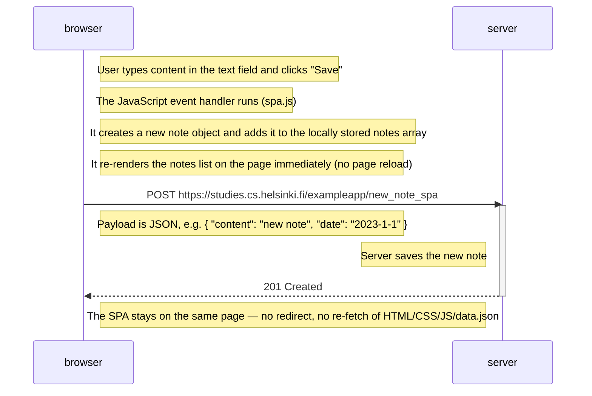

```mermaid
sequenceDiagram
    participant browser
    participant server

    Note right of browser: User types content in the text field and clicks "Save"
    Note right of browser: The JavaScript event handler runs (spa.js)
    Note right of browser: It creates a new note object and adds it to the locally stored notes array
    Note right of browser: It re-renders the notes list on the page immediately (no page reload)

    browser->>server: POST https://studies.cs.helsinki.fi/exampleapp/new_note_spa
    activate server
    Note right of browser: Payload is JSON, e.g. { "content": "new note", "date": "2023-1-1" }
    Note left of server: Server saves the new note
    server-->>browser: 201 Created
    deactivate server

    Note right of browser: The SPA stays on the same page — no redirect, no re-fetch of HTML/CSS/JS/data.json
```